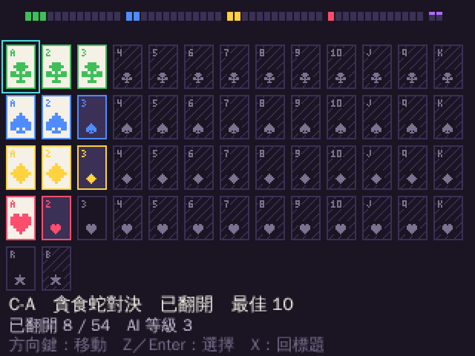

# Beat the Deck

> Beat the machine 54 times, or become part of its training data.

一副 54 張牌的 AI 對戰街機。每張牌是一個小遊戲，你和 AI 在同一套規則下比分數。四個花色是四種遊戲機制，各自從 A 進化到 K；四個花色的 AI 各有一種性格。兩張鬼牌不比輸贏。

在瀏覽器裡玩，不需要安裝，不需要顯示卡。

## 狀態

**可以玩，但只做了 54 張牌裡的 13 張。** 網址：<https://jadiouo.github.io/beat-the-deck/>

- 已完成並登記的 13 張：梅花 `C-A`、`C-2`、`C-3`；黑桃 `S-A`、`S-2`、`S-3`；方塊 `D-A`、`D-2`、`D-3`；紅心 `H-A`、`H-2`、`H-3`；紅鬼牌 `JK-R`（一起亂畫，沒有輸贏）。
- **還沒做的 41 張**：四個花色的 4 到 K（每個花色 10 張，共 40 張），加上黑鬼牌 `JK-B`。牌桌上這些格子標示為「尚未開放」。
- 外殼（標題、牌桌、說明頁、對局、結算、重播、AI 進化畫面、音效、進度存檔）可以在瀏覽器裡玩；進度存在瀏覽器的 localStorage。
- 測試：`npm run check` 通過，52 個測試檔、1187 個測試通過（另有 12 個刻意略過）；`npm run e2e` 10 條通過（另有 4 條產生截圖的測試，平常略過）。
- 已知限制：解鎖規則是翻開 13 張後才開放 JK-R，但目前能贏的一般牌只有 12 張，所以從牌桌選不到 JK-R；直接開 `/?card=JK-R` 可以玩。等有更多牌之後這就不是問題。



## 怎麼跑

需要 Node.js 22。

```sh
npm ci            # 安裝開發依賴（遊戲本體沒有任何執行期依賴）
npm run dev       # 開發伺服器，http://127.0.0.1:5173/
npm run check     # 型別、lint、單元測試與契約測試（約 4 分鐘）
npm run e2e       # 端到端測試（Playwright；第一次要 npx playwright install chromium）
npm run build     # 正式版，輸出到 dist/，網站放在 /beat-the-deck/ 底下
```

`main` 分支的每次 push 在 check 與 e2e 都通過後，會由 GitHub Actions 自動發布到 GitHub Pages。

## 文件

| 檔案 | 內容 |
|---|---|
| `docs/SPEC.md` | 規格：這個東西是什麼、架構、遊戲契約、AI、54 張牌的表 |
| `docs/TEST_PLAN.md` | 測試計畫：先寫哪些測試、每一層測什麼、通過標準 |
| `docs/TASKS.md` | 任務清單：每一個任務是一個雲端 session 的量，附可以直接貼的指令 |
| `CLAUDE.md` | 給 Claude Code 的工作規則 |

## 怎麼繼續做

把 `docs/TASKS.md` 的「之後的牌」那段指令貼給 Claude Code，一次做同一個花色的 2 到 3 張牌；不同花色的 session 可以同時開。
